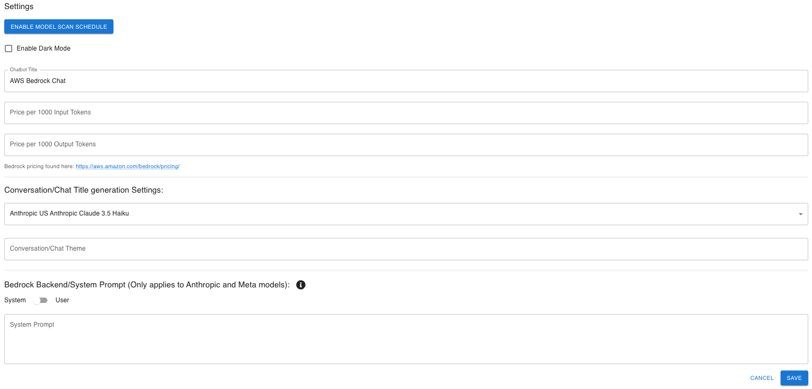
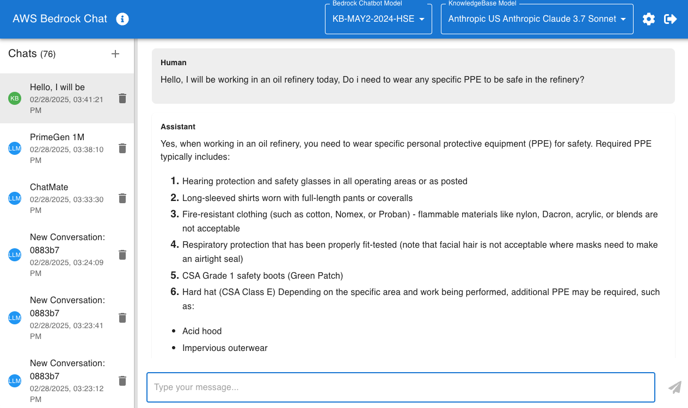
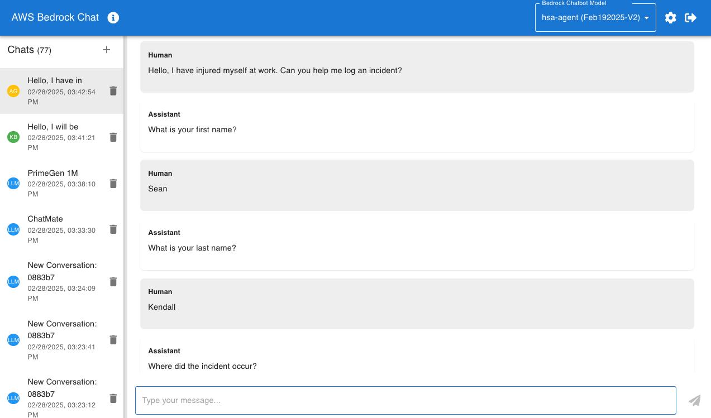

# AWS Chatbot Application with Bedrock Agents and Claude-3
<!-- MD formats here: https://docs.github.com/en/get-started/writing-on-github/getting-started-with-writing-and-formatting-on-github/basic-writing-and-formatting-syntax -->

## Tdlr;
> [!NOTE]
> Use [Cloud9](https://aws.amazon.com/pm/cloud9) for a fast start, using any instance size larger than a 'small' size.
>
> us-east-1 and us-west-2 are the only supported regions. us-west-2 is the only region with Anthropic Claude 3 Opus


clone this repo + run setup.sh and deploy.sh: 
```bash
git clone https://github.com/seandkendall/genai-bedrock-chatbot.git --depth 1
cd genai-bedrock-chatbot
./setup.sh
./deploy.sh
```

This is a serverless application that provides a chatbot interface using AWS services and the Anthropic Claude-3 language model. The application features two modes: Bedrock Agents and Bedrock. In Bedrock Agents mode, users can interact with Bedrock Agents powered by a knowledgebase containing HSE (health and safety) data. In Bedrock mode, users can engage in open-ended conversations with the Claude-3 language model.

## Architecture

The application utilizes the following AWS services:

- **AWS Lambda**: Serverless functions for handling WebSocket connections, Bedrock Agent interactions, and Bedrock model invocations.
- **AWS API Gateway WebSocket API**: WebSocket API for real-time communication between the frontend and backend.
- **AWS DynamoDB**: Storing conversation histories and incident data.
- **AWS S3**: Hosting the website content and storing conversation histories.
- **AWS CloudFront**: Content Delivery Network for efficient distribution of the website.
- **AWS Cognito**: User authentication and management.
- **AWS Bedrock**: Bedrock Agents and Bedrock runtime for language model interactions.


## Screenshots

1. This is what the interface looks like, here we are simply communicating with Anthropic Claude3 Sonnet


2. You can ask the chatbot to write code for you. Here we are using Anthropic Claude 3 Sonnet to show us python code


3. There are settings you can change at a user and global level (Global if you have multiple users using this app). You can configure a Bedrock KnowledgeBase ID to simply enable RAG. You can also configure the Agent ID and Agent Alias ID if you would like to use this chatbot with a Bedrock Agent. You can set a system prompt at the user or system level so all interactions have a standard context set. You can also set custom pricing per 1000 input/output tokens, however without saving this value, the app will use the price saved in the code which is built from the AWS Bedrock pricing page. Finally, you can select your model.


4. This is an example of interacting with Bedrock Knowledgebases, enabling RAG with Anthropic Claude3 Sonnet


5. This is an example of interacting with Bedrock Agents, where we can ask questions about the data sitting behind our KnowledgeBase or have the chatbot interact with API's in the backend. This example shows how Bedrock Agents can use an AWS Lambda function to log an inciden into a DynamoDB Table. The sample code for this demo is also included in thie repository if you wish to test by manually creating the KnowledgeBase and Agent. If you need help with this, feel free to reach out to me at [Seandall@Amazon.com](mailto:Seandall@Amazon.com)


6. If you mouse-over the info icon in the header, you can see additional details such as the current cost, session ID's, and total input/output tokens. Since Bedrock today only supportes token metrics for the Bedrock Runtime, the tokens and cost shown here are only for communicating with an LLM directly. If you are using KnowledgeBases or Agents, these values are not reflected here


## Prerequisites

Before deploying the application, ensure you have the following installed:

- [Python 3](https://www.python.org/) (version 3.7 or later)
- [pip](https://pip.pypa.io/en/stable/installing/) (Python package installer)
- [Git](https://try.github.io/) - click for a quick interactive tutorial
- [jq](https://jqlang.github.io/jq)
- [AWS CLI](https://aws.amazon.com/cli/) (Configured with your AWS credentials)
- [AWS CDK](https://aws.amazon.com/cdk/) (version 2.x)
- [Node.js](https://nodejs.org/en/) (version 12.x or later)

### Installing Python and pip on Windows

1. Download the latest Python installer from the official Python website (https://www.python.org/downloads/).
2. Run the installer and make sure to select the option to add Python to the system PATH.
3. Open the Command Prompt and run the following command to install pip:

   ```
   python -m ensurepip --default-pip
   ```

### Installing Python and pip on macOS

1. Open the Terminal and run the following command to install Python and pip:

   ```
   brew install python3
   ```

2. If you don't have Homebrew installed, you can install it by following the instructions at https://brew.sh/.

### Installing AWS CLI

Follow the instructions in the [AWS CLI documentation](https://docs.aws.amazon.com/cli/latest/userguide/cli-chap-install.html) to install the AWS CLI for your operating system.

After installing the AWS CLI, run the following command to configure it with your AWS credentials:

```
aws configure
```

This command will prompt you to enter your AWS Access Key ID, AWS Secret Access Key, AWS Region, and default output format. You can find your AWS credentials in the AWS Management Console under the "My Security Credentials" section.

### Installing AWS CDK

Run the following command to install the AWS CDK:

```
npm install -g aws-cdk
```

## Getting Started

To deploy the application on your local machine, follow these steps:

1. Clone the repository:

   ```
   git clone https://github.com/seandkendall/genai-bedrock-chatbot --depth 1
   cd genai-bedrock-chatbot
   ```

2. Deploy the application stack:
   Simply run these 2 commands. setup is a one time command to make sure you have the correct packages set-up. deploy can be used for each change you make in the chatbot.
   ```
   ./setup.sh
   ./deploy.sh
   ```

   The deployment process will create all the necessary resources in your AWS account.

## Deployment on Windows

To deploy the application on a Windows machine, follow these steps:

1. Install the [AWS CLI](https://docs.aws.amazon.com/cli/latest/userguide/cli-chap-install.html) and [Node.js](https://nodejs.org/en/download/) for Windows.
2. Open the Command Prompt or PowerShell and follow the "Getting Started" section above.

## Deployment on Mac

To deploy the application on a Mac, follow these steps:

1. Install the [AWS CLI](https://docs.aws.amazon.com/cli/latest/userguide/cli-chap-install.html) and [Node.js](https://nodejs.org/en/download/) for macOS.
2. Open the Terminal and follow the "Getting Started" section above.

## Git

This project relies on Git for version control. If you're new to Git, we recommend going through the [Try Git](https://try.github.io/) interactive tutorial to get familiar with the basic Git commands and workflow.

Additionally, here are some other helpful resources for learning Git:

- [Git Documentation](https://git-scm.com/doc)
- [Git Handbook](https://guides.github.com/introduction/git-handbook/)
- [Git Tutorial for Beginners](https://www.vogella.com/tutorials/GitTutorial/article.html)


## Contributing

Contributions are welcome! Please feel free to submit a Pull Request or open an issue for any bugs, feature requests, or improvements.

## Bugs or Enhancements?
If you simply want to tell me a bug, e-mail me at [Seandall@Amazon.com](mailto:Seandall@Amazon.com)