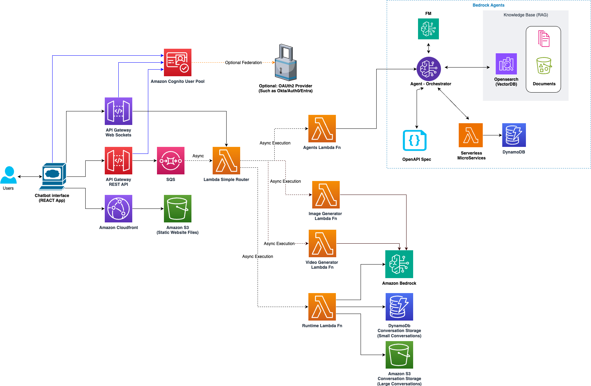
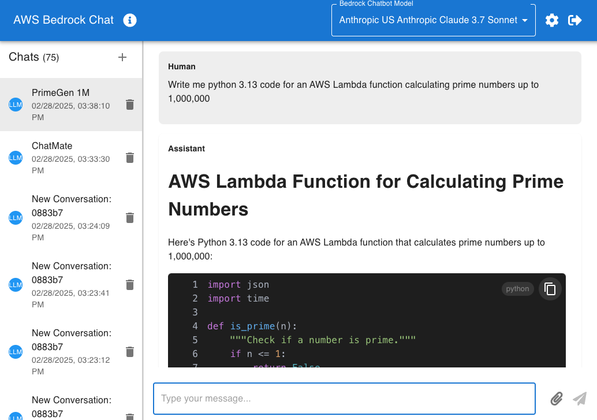

# AWS Chatbot Application with Bedrock Agents and Claude-3
<!-- MD formats here: https://docs.github.com/en/get-started/writing-on-github/getting-started-with-writing-and-formatting-on-github/basic-writing-and-formatting-syntax -->

<details open>
<summary>Quick Deploy Solution (With CI/CD)</summary>
<a name="quick-deploy-solution-link"></a>

# Quick Deploy Guide


For a quick start, use the [CI/CD](https://docs.aws.amazon.com/prescriptive-guidance/latest/strategy-cicd-litmus/understanding-cicd.html) script which will set-up a [CodeBuild](https://aws.amazon.com/codebuild/) project, automating the deployment.


1. Login to [your AWS account](https://console.aws.amazon.com/console/home)

2. Click the [AWS CloudShell](https://aws.amazon.com/cloudshell/) Icon 


A Terminal Will open at the bottom of your screen

This terminal is already configured to execute commands againt your AWS account

3. Clone the git repository and "Change Directory" into the cloned git repository (commands below)
```bash
git clone https://github.com/seandkendall/genai-bedrock-chatbot.git
cd genai-bedrock-chatbot
```
4. Finally run the ./deploy-cicd.sh script which will create a CodeBuild project, and automatically deploy the Chatbot

**Option 1:** Deploy using a domain allow-list
```bash
./deploy-cicd.sh --allowlist @example.com,@example.ca
```

**Option 2:** Deploy without an allowlist (anyone can register for the chatbot)
```bash
./deploy-cicd.sh
```

**Option 3:** Deploy using a domain allow-list, but delete old CodeBuild resources first
```bash
./deploy-cicd.sh -d --allowlist @example.com,@example.ca
```

**Option 4:** Deploy from a branch using a domain allow-list, but delete old CodeBuild resources first
```bash
./deploy-cicd.sh -d --allowlist @example.com,@example.ca --branch feature_branch
```

**Option 5 (adding the -a flag):** Deploy from a 'main' or the latest feature branch on each deploy without the need to specify the branch name using a domain allow-list, but delete old CodeBuild resources first
```bash
./deploy-cicd.sh -a -d --allowlist @example.com,@example.ca --schedule daily
```

**Option 6 (Adding --deepseek flag to deploy deepseek models as custom models):** 
Deploy from a 'main' branch on each deploy using a domain allow-list, delete old CodeBuild resources first, deploy custom deepseek models (this incurs additional costs, on S3, CodeBuild and Bedrock)
```bash
./deploy-cicd.sh -d --allowlist @example.com,@example.ca --schedule daily --deepseek
```

On any of these options, you can also specify a flag for `--schedule daily` if you would like to redeploy the latest changes daily, otherwise weekly releases will be auto-deployed


5. Navigate to your CodeBuild console to view the status and the logs

[CodeBuild History](https://console.aws.amazon.com/codesuite/codebuild/projects/genai-bedrock-chatbot-build/history)

6. Navigate to your CloudFormations console to view the chatbot URL

[CloudFormations Outputs](https://console.aws.amazon.com/cloudformation/home#/stacks/outputs?filteringText=&filteringStatus=active&viewNested=true&stackId=ChatbotWebsiteStack)

Your Chatbot URL is the URL value beside 'AWSChatBotURL'


</details>

<details>
<summary>Local Deploy (Works on Mac + Linux)</summary>
clone this repo + run setup.sh and deploy.sh: 

```bash
git clone https://github.com/seandkendall/genai-bedrock-chatbot.git
cd genai-bedrock-chatbot
./setup.sh
./deploy.sh --redeploy
```

Or if you want to also Deploy the DeepSeek imported models:
```bash
git clone https://github.com/seandkendall/genai-bedrock-chatbot.git
cd genai-bedrock-chatbot
./setup.sh
./deploy.sh --redeploy --deepseek
```

</details>

### What is this GenAI Serverless ChatBot?

This is a serverless application that provides a chatbot interface using Serverless AWS services and multiple Large Language Models (LLM) provided by Amazon Bedrock such as Anthropic Claude 3 Sonnet, Anthropic Claude 3.5/3.7 Sonnet, Anthropic Claude 3 Opus, Amazon Titan models (including Nova Lite, Nova Micro, Nova Pro, Nova Reel {for video generation}, Nova Canvas {for Image generation}), Meta Llama models (including but not limited to Llama 2, Llama 3, Llama 3.1 and Llama 3.2 models and model variants), Mistral AI models, Stability AI models (such as SDXL 1.0, SD3 Large 1.0, Stable Image Core 1.0, Stable Image Ultra 1.0), Luma AI models such as Luma Ray 2 for video generation. 

The code was built using the [Converse API](https://aws.amazon.com/about-aws/whats-new/2024/05/amazon-bedrock-new-converse-api/) which allows the Chatbot to automatically work with new LLM (Large Language Models) introduced to Amazon Bedrock. 

The application features multiple modes allowing you to interact directly with Large Language Models or integrate your data by creating a Bedrock KnowledgeBase. If you would like more complex functionality, this demo also support Amazon Bedrock Agents allowing you to orchestrate between LLM Knowledge, Bedrock KnowledgeBases and Function calling with integrations to AWS Lambda. 

Finally, you can utilize Amazon Bedrock Prompt Flows to build your own orchestration/flow with Bedrock, and use this interface to interact with the Prompt Flow

Included in this code base is an Amazon Bedrock Agent powered by a Bedrock Knowledgebase containing HSE (health and safety) data.

Once you create a published Bedrock Agent, KnowledgeBase or Prompt Flow, it will show up in the "Select a Model" Dropdown located in the application header. If the created/published item does not show up immediately, it can take up to 15 minutes to refresh the header cache. 

Due to the rapid gorwth of LLM choices and capabilities, there is now a "ModelScan" Job introduced in this app which is turned on by default. This Lambda Job is triggered through Amazon EventBridge daily and will send a quick prompt to each available Bedrock model to validate if there is a successful response. This data is used to populate the Model selection dropdown, and understand when to allow the user to upload documents or images for a MultiModal request to a LLM.

You can turn this schedule on or off from the option within the application settings located in the App header.

You can force a refresh of the available Models by clicking the 'Model selection' dropdown, and selecting the last available option: "Reload Models". This should take ~ 60 seconds to complete

## Architecture

The application utilizes the following AWS services:

- **AWS Lambda**: Serverless functions for handling WebSocket connections, Bedrock Agent interactions, and Bedrock model invocations.
- **AWS API Gateway WebSocket API**: WebSocket API for real-time communication between the frontend and backend.
- **AWS DynamoDB**: Storing conversation histories and incident data.
- **AWS S3**: Hosting the website content and storing conversation histories, generated images and input documents
- **AWS CloudFront**: Content Delivery Network for efficient distribution of the website.
- **AWS Cognito**: User authentication and management.
- **AWS Bedrock**: Bedrock Agents, Bedrock KnowledgeBases, Bedrock Prompt Flows and Bedrock Runtime for large language model interactions.
- **AWS CodeDeploy (Optional)**: Used as CI/CD pipeline to automatically deploy the application without the need for a local environment or Cloud9



## Screenshots

1. This is what the interface looks like, here we are simply communicating with Anthropic Claude3 Sonnet


2. You can ask the chatbot to write code for you. Here we are using Anthropic Claude 3.5 Sonnet to show us python code


3. There are settings you can change at a user and global level (Global if you have multiple users using this app). You can set a system prompt at the user or system level so all interactions have a standard context set. You can also set custom pricing per 1000 input/output tokens, however without saving this value, the app will use the price saved in the code which is built from the AWS Bedrock pricing page. Finally, you can select "SDXL 1.0" Image properties once this model is selected in the header.


4. This is an example of interacting with Bedrock Knowledgebases, enabling RAG with Anthropic Claude Instant


5. This is an example of interacting with Bedrock Agents, where we can ask questions about the data sitting behind our KnowledgeBase or have the chatbot interact with API's in the backend. This example shows how Bedrock Agents can use an AWS Lambda function to log an inciden into a DynamoDB Table. The sample code for this demo is also included in thie repository if you wish to test by manually creating the KnowledgeBase and Agent. If you need help with this, feel free to reach out to me at [Seandall@Amazon.com](mailto:Seandall@Amazon.com)


6. If you mouse-over the info icon in the header, you can see additional details such as the current cost, session ID's, and total input/output tokens. Since Bedrock today only supportes token metrics for the Bedrock Runtime, the tokens and cost shown here are only for communicating with an LLM directly. If you are using KnowledgeBases or Agents, these values are not reflected here


## Local Dev Environment Prerequisites

Before deploying the application, ensure you have the following installed:

- [Python 3](https://www.python.org/) (version 3.7 or later)
- [pip](https://pip.pypa.io/en/stable/installing/) (Python package installer)
- [Git](https://try.github.io/) - click for a quick interactive tutorial
- [jq](https://jqlang.github.io/jq)
- [AWS CLI](https://aws.amazon.com/cli/) (Configured with your AWS credentials)
- [AWS CDK](https://aws.amazon.com/cdk/) (version 2.x)
- [Node.js](https://nodejs.org/en/) (version 12.x or later)

### Installing Python and pip on Windows

1. Download the latest Python installer from the official Python website (https://www.python.org/downloads/).
2. Run the installer and make sure to select the option to add Python to the system PATH.
3. Open the Command Prompt and run the following command to install pip:

   ```
   python -m ensurepip --default-pip
   ```

### Installing Python and pip on macOS

1. Open the Terminal and run the following command to install Python and pip:

   ```
   brew install python3
   ```

2. If you don't have Homebrew installed, you can install it by following the instructions at https://brew.sh/.

### Installing AWS CLI

Follow the instructions in the [AWS CLI documentation](https://docs.aws.amazon.com/cli/latest/userguide/cli-chap-install.html) to install the AWS CLI for your operating system.

After installing the AWS CLI, run the following command to configure it with your AWS credentials:

```
aws configure
```

This command will prompt you to enter your AWS Access Key ID, AWS Secret Access Key, AWS Region, and default output format. You can find your AWS credentials in the AWS Management Console under the "My Security Credentials" section.

### Installing AWS CDK

Run the following command to install the AWS CDK:

```
npm install -g aws-cdk
```

## Getting Started

To deploy the application on your local machine, follow these steps:

1. Clone the repository:

   ```
   git clone https://github.com/seandkendall/genai-bedrock-chatbot
   cd genai-bedrock-chatbot
   ```

2. Deploy the application stack:
   Simply run these 2 commands. setup is a one time command to make sure you have the correct packages set-up. deploy can be used for each change you make in the chatbot.
   ```
   ./setup.sh
   ./deploy.sh
   ```

   The deployment process will create all the necessary resources in your AWS account.

## Deployment on Windows

To deploy the application on a Windows machine, follow these steps:

1. Install the [AWS CLI](https://docs.aws.amazon.com/cli/latest/userguide/cli-chap-install.html) and [Node.js](https://nodejs.org/en/download/) for Windows.
2. Open the Command Prompt or PowerShell and follow the "Getting Started" section above.

## Deployment on Mac

To deploy the application on a Mac, follow these steps:

1. Install the [AWS CLI](https://docs.aws.amazon.com/cli/latest/userguide/cli-chap-install.html) and [Node.js](https://nodejs.org/en/download/) for macOS.
2. Open the Terminal and follow the "Getting Started" section above.

## Git

This project relies on Git for version control. If you're new to Git, we recommend going through the [Try Git](https://try.github.io/) interactive tutorial to get familiar with the basic Git commands and workflow.

Additionally, here are some other helpful resources for learning Git:

- [Git Documentation](https://git-scm.com/doc)
- [Git Handbook](https://guides.github.com/introduction/git-handbook/)
- [Git Tutorial for Beginners](https://www.vogella.com/tutorials/GitTutorial/article.html)

## Updating npm packages with npm-check -u
To make sure the project is always using patched and latest versions of packages, periodically run `npm-check -u`

You may need to install this on your machine first, this can be done by running this npm command:

```
npm install -g npm-check
```

**Usage:**
### upgrade project npm packages
```
cd ./cdk/react-chatbot
npm-check -u
```

### upgrade global (system level) npm packages
```
npm-check -u -g
```

[Learn more about npm-check](https://www.npmjs.com/package/npm-check)

## Serverless, CDK & GenAI Patterns
Here are a list of patterns you will see in this code to help you write your own serverless application on AWS:
 
 1. Use AWS CDK V2 for python to deploy AWS Lambda functions (both ARM_64 and X86_64) with Layers using the PythonLayerVersion construct
 2. Use AWS CDK V2 for python to deploy an AWS Lambda function using a Lambda Container Image, allowing you to package more than 250MB into a single Function. This pattern allows you to increase the function size to 10GB; however, you will no longer be able to see your code inside of the web-IDE
 3. Use AWS CDK V2 for python to Create EventBridge Scheduler, one-time schedules as well as recurring schedules
 4. Use AWS CDK V2 for python to create Amazon S3 buckets, Cloudfront Distributions (Using S3 and API Gateway as origins), DynamoDB Tables, APIGateway HTTP API's, Cognito User Pools (utilizing a pre-signup function to restrict users to certain domains)
 5. Use AWS CDK V2 for python to add custom policies to generated Lambda function Roles
 6. Connecting APIGateway HTTP API's and Websocket API's, AWS Lambda Functions, DynamoDB, S3, and Amazon Bedrock (for Generative AI) to build an interactive chatbot flow
 7. Automating an Amazon Bedrock custom model import from huggingface (Using DeepSeek)
 8. Building Agentic AI flows using Amazon Bedorck Agents
 9. Building data-rich generative AI experiences using Amazon Bedrock Knowledgebases
 10. Generating Images and Videos using Amazon Bedrock with AI Models such as Amazon Nova Reel, Amazon Nova Canvas, Stability AI - Stable Diffusion 3.5, and Luma AI Ray V2

## Useful Links
 - Bedrock Converse API Capabilities per model: [https://docs.aws.amazon.com/bedrock/latest/userguide/conversation-inference-supported-models-features.html](https://docs.aws.amazon.com/bedrock/latest/userguide/conversation-inference-supported-models-features.html)
 - Amazon Nova User Guide: [https://docs.aws.amazon.com/pdfs/nova/latest/userguide/nova-ug.pdf](https://docs.aws.amazon.com/pdfs/nova/latest/userguide/nova-ug.pdf)
 - Bedrock Runtime Documentation: (https://docs.aws.amazon.com/bedrock/latest/userguide/service_code_examples_bedrock-runtime.html)[https://docs.aws.amazon.com/bedrock/latest/userguide/service_code_examples_bedrock-runtime.html]
 - Bedrock Runtime Boto3 Documentation: (https://boto3.amazonaws.com/v1/documentation/api/latest/reference/services/bedrock-runtime.html)[https://boto3.amazonaws.com/v1/documentation/api/latest/reference/services/bedrock-runtime.html]

 

## Contributing

Contributions are welcome! Please feel free to submit a Pull Request or open an issue for any bugs, feature requests, or improvements.

## Bugs or Enhancements?
If you simply want to tell me a bug, e-mail me at [seandall@amazon.com](mailto:seandall@amazon.com)